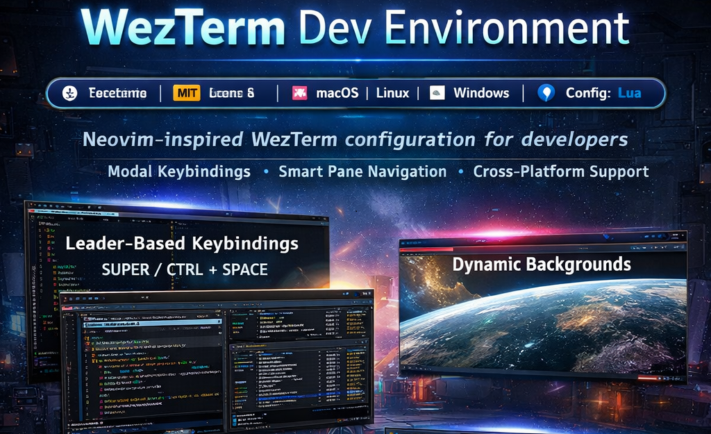

<div align="center">

  

</div>

[](https://wezterm.org/)
[](LICENSE)
[](https://www.lua.org/about.html)
---

A **modular, Neovim-inspired configuration** for WezTerm, optimized for developers seeking speed, clarity, and complete control over their terminal workflow.

Key focuses:

* Clean and maintainable architecture
* Cross-platform consistency
* Modal keybindings and leader modes
* Smart pane navigation
* Safe extensibility

---

## What Is WezTerm

[WezTerm](https://wezfurlong.org/wezterm/) is a GPU-accelerated terminal emulator and multiplexer written in Rust. It supports:

* Multiple tabs and panes
* Cross-platform operation (macOS, Linux, Windows, BSD)
* Lua-based configuration
* SSH and WSL integration
* Advanced rendering features

Official documentation: [wezfurlong.org](https://wezfurlong.org/wezterm/)

---

## Key Features

*Terminal Experience*

* GPU-accelerated rendering
* Dynamic background system
* Custom color schemes
* Cross-platform modifier abstraction
* Event-driven statusline customization
* WSL integration for Windows

---

## Neovim-Inspired Workflow

This configuration adopts a modal editor mindset.

### Leader-Based Modes

Leader key: `SUPER|CTRL + Space`

Available modes:

* Font resizing
* Pane resizing
* Pane swapping

---

### Smart Pane Navigation

Directional movement uses:

```
h  j  k  l
```

Behavior:

* Moves between panes
* Falls back to tab switching for horizontal directions
* Preserves workflow consistency

---

### Tab and Workspace Management

* Spawn new tabs quickly
* Launch WSL-specific tabs
* Reorder tabs easily
* Fuzzy tab launcher
* Workspace launcher integration

---

### Modifier Model

| Name     | macOS Mapping | Windows/Linux Mapping |            |               |
| -------- | ------------- | --------------------- | ---------- | ------------- |
| `SUPER`  | ⌘ Command     | Alt                   |            |               |
| `SUPER   | CTRL`         | ⌘ + Ctrl              | Alt + Ctrl |               |
| `LEADER` | `SUPER        | CTRL + Space`         | `SUPER     | CTRL + Space` |

> `LEADER` is defined as `Space` combined with `SUPER|CTRL`.

Full keybinding reference: [KEYBINDINGS.md](./Keybindings.md)

---

## Architecture

The configuration is **modular and layered**:

```
wezterm.lua
config/
utils/
events/
colors/
backdrops/
```

### Layers

* `config/` → Core configuration modules
* `utils/` → Pure Lua helper modules
* `events/` → UI and statusline logic
* `colors/` → Theme definitions
* `backdrops/` → Background assets

Detailed explanation: [ARCHITECTURE.md](./Architecture.md)

---

## 1. Install WezTerm

### macOS

```bash
brew install wezterm
```

### Ubuntu / Debian

```bash
sudo apt update
sudo apt install wezterm
```

### Windows (winget)

```bash
winget install wez.wezterm
```

Official [installation guide](https://wezfurlong.org/wezterm/installation.html)

---

## 2. Clone Configuration

### macOS / Linux

```bash
git clone https://github.com/hetfs/wezterm ~/.config/wezterm
```

### Windows

Clone into:

```
%USERPROFILE%\.config\wezterm
```

Refer to [WezTerm Config Path Documentation](https://wezfurlong.org/wezterm/config/files.html)

---

## Customization

The configuration is **fully Lua-based**.

Main entry point:

```
wezterm.lua
```

Core modules:

```
config/
```

You can safely customize:

* Keybindings → `config/bindings.lua`
* Fonts → `config/fonts.lua`
* Appearance → `config/appearance.lua`
* Background behavior → `utils/backdrops.lua`
* Statusline → `events/`

The modular design ensures experimentation without breaking unrelated features.

---

## Roadmap Ideas

* Multiple theme presets
* Workspace presets
* Plugin-style feature toggles
* Remote SSH workspace templates
* Performance profiling presets

---

## Philosophy

Guiding principles:

* Intentional key design
* Modal interaction and leader modes
* Cross-platform reliability
* Clean internal architecture
* Long-term maintainability

Designed as a structured, maintainable project rather than a single-file dotfile.

---

## Star History

[](https://www.star-history.com/#hetfs/wezterm.git&type=timeline&legend=top-left)
